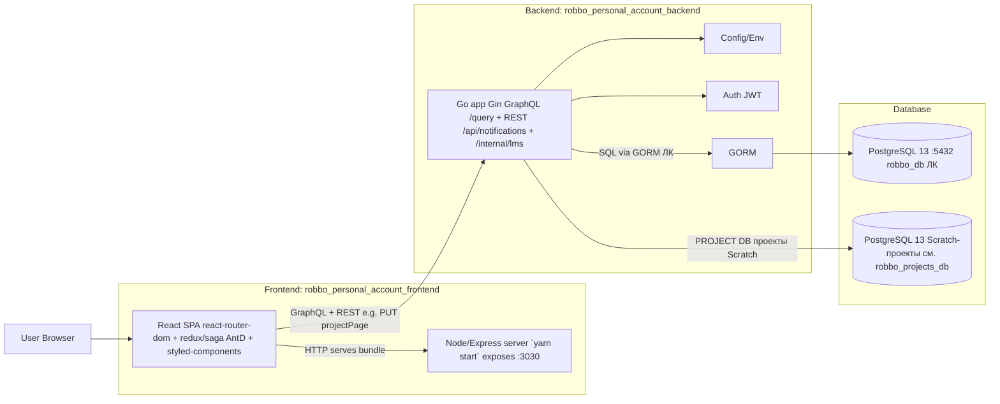
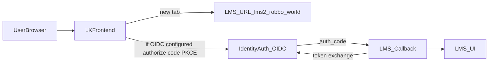

```mermaid
flowchart TB
  subgraph DockerCompose[Docker Compose]
    subgraph FEc[Frontend compose]
      FEsvc[web build: . ports: 3030:3030 network_mode: host]
    end

    subgraph BEc[Backend compose]
      BEsvc[app build: . ports: 8080:8080 depends_on: postgres(healthy)]
      PGsvc[postgres image: postgres:13 ports: 5432:5432 volume: postgres_data]
    end
  end

  FEsvc -->|calls backend (GraphQL)| BEsvc
  BEsvc --> PGsvc
```



Пересборка контейнеров ЛК: фронт — сервис `web` в `robbo_personal_account_frontend` (или дубликат `robbo_personal_account/frontend`, если прод оттуда); бэкенд — сервис `app`, проект compose `rpa2`. После `docker compose build` выполнять `up -d --build` для того же сервиса. Подробнее: `ARCHITECTURE_DETAILED_RU.md` (раздел Docker Compose), `change_log.md`.

ЛК: на `/home` у админов юнита и суперадмина в сайдбаре — кнопка «Отправить уведомление» над меню (см. `ARCHITECTURE_DETAILED_RU.md`, inbox уведомлений).

Монорепо-обёртка с субмодулями: [github.com/gamr416/robbo_personal_account](https://github.com/gamr416/robbo_personal_account) — в `README` ссылки на `tree/main` frontend/backend.

**БД Scratch-проектов (метаданные карточки + storage `.sb3`):** каталог [`robbo_projects_db/`](../robbo_projects_db/) — `docker-compose.yml` (`5433` на хосте), `init/01_schema.sql` и идемпотентная миграция `init/02_upgrade_pre_meta_projects.sql` для уже существующих томов; таблицы `scratch_projects` (поля включая `title`, `instruction`, `note`, `is_public`, `scratch_vm_json` для совместимости REST `/project/`), версии `.sb3` в `scratch_project_versions`, маппинг старых id ЛК в `scratch_project_legacy_map`; backfill однократно: `scripts/backfill_lk_projects.py`. Backend: второй DSN — `projectsPostgres.postgresDsn` в `package/config/config.yml`, env `PROJECTS_POSTGRES_DSN`.

