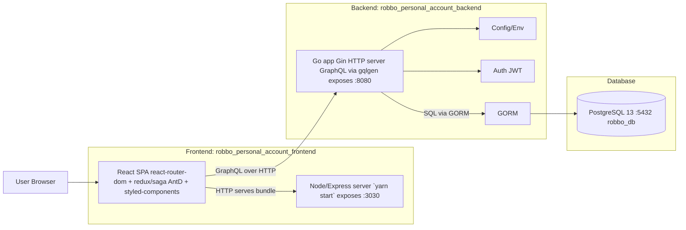

```mermaid
flowchart TB
  subgraph DockerCompose[Docker Compose]
    subgraph FEc[Frontend compose]
      FEsvc[web build: . ports: 3030:3030 network_mode: host]
    end

    subgraph BEc[Backend compose]
      BEsvc[app build: . ports: 8080:8080 depends_on: postgres(healthy)]
      PGsvc[postgres image: postgres:13 ports: 5432:5432 volume: postgres_data]
    end
  end

  FEsvc -->|calls backend (GraphQL)| BEsvc
  BEsvc --> PGsvc
```

