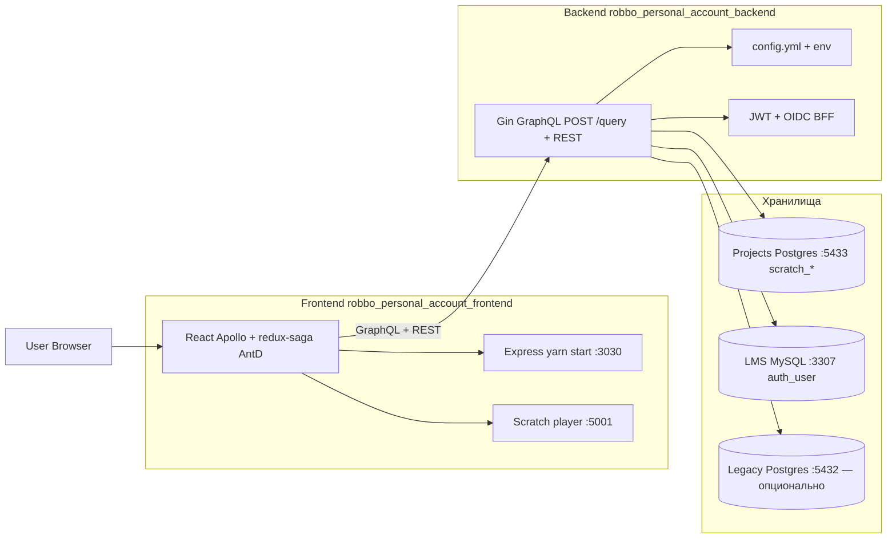
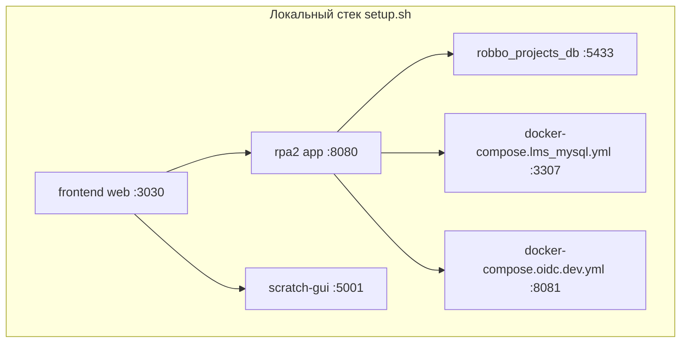
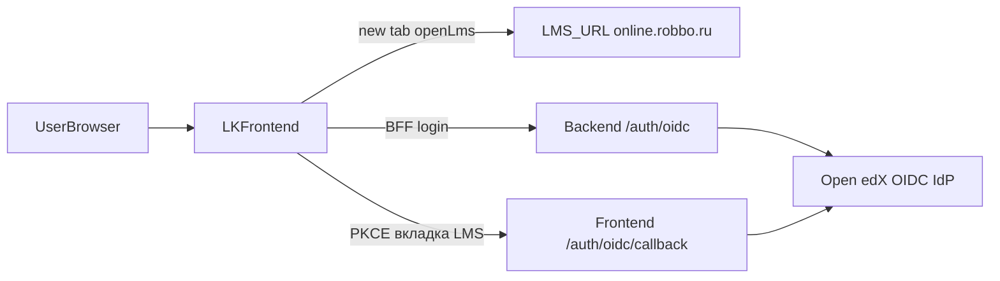

Пересборка контейнеров ЛК: фронт — сервис `web` в `robbo_personal_account_frontend`; бэкенд — сервис `app`, проект `rpa2`. После `build` — `up -d --build`. См. `ARCHITECTURE_DETAILED_RU.md`, `change_log.md`.

**Где править код:** только `robbo_personal_account_frontend/` и `robbo_personal_account_backend/`. `robbo_personal_account/` — монорепо с субмодулями (`setup.sh`); исходный код там не менять.

**Инвентарь функционала:** [FUNCTIONALITY_RU.md](FUNCTIONALITY_RU.md).

Монорепо: [github.com/gamr416/robbo_personal_account](https://github.com/gamr416/robbo_personal_account).

**БД:** Projects — [`robbo_projects_db/`](../robbo_projects_db/) (`PROJECTS_POSTGRES_DSN`, `:5433`). Пользователи — LMS MySQL (`LMS_MYSQL_DSN`). Legacy — `legacyPostgres.enabled`. См. [LEGACY_POSTGRES_CUTOVER.md](LEGACY_POSTGRES_CUTOVER.md).
