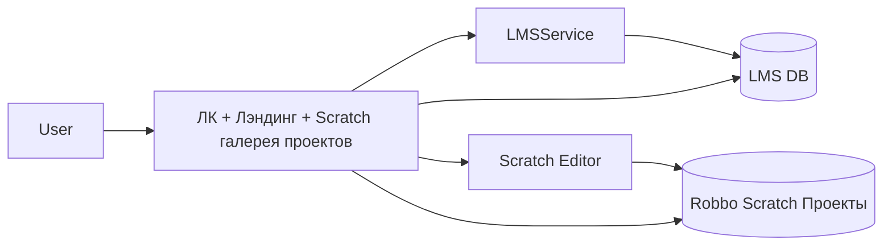

# Целевая архитектура LMS + ЛК + Редактор

## 1) Принцип разделения доменов

- **Identity-домен (источник правды по пользователю)**: отдельный сервис `Identity/Auth` (или ЛК как временный owner), хранит учетные данные, роли, базовый профиль.
- **LMS-домен**: только обучение (курсы, прогресс, зачисления, оценки, попытки).
- **Scratch-домен (редактор на scratch.ru)**: включает UI/редактор и встроенный storage-слой проектов.
- **Storage как часть scratchEditor**: отдельный сервис не выделяется, API хранения находится в контуре scratch.
- ЛК работает как **BFF/портал** и агрегирует данные из LMS, Identity и scratchEditor.
- Для удобства клонирования используется монорепо-обёртка [gamr416/robbo_personal_account](https://github.com/gamr416/robbo_personal_account) с субмодулями frontend/backend; актуальный `main` кода — по ссылкам из её `README`.

## 2) Данные и ownership

- **Identity/Auth DB**:
  - `user_id (UUID)`, email/login, hash пароля/внешний auth-id, базовые поля профиля, роли.
  - таблицы ЛК-метаданных (без карточек Scratch-проектов): связи наставник-ученик, статусы мониторинга прогресса.
- **LMS DB**:
  - `course`, `lesson`, `enrollment`, `progress`, `grade`, ссылки на `user_id`.
- **Scratch / PROJECT DB (PostgreSQL, единый источник правды по ученическим Scratch-проектам в ЛК)**:
  - Репозиторий схемы и Docker: каталог **`robbo_projects_db/`** (`docker-compose.yml`, `init/01_schema.sql`, поверх существующих томов — `init/02_upgrade_pre_meta_projects.sql`).
  - Таблицы (**ровно 3**): **`scratch_projects`**, **`scratch_project_versions`**, **`scratch_project_audit_events`**. `owner_user_id` = `edx_user_id` из JWT; `id` проекта — UUID.
  - **Backend ЛК**: projects gateway → `PROJECTS_POSTGRES_DSN` только для Scratch.
  - **Пользователи и профиль** — LMS MySQL `auth_user`, не Projects DB.
  - Legacy `project_dbs` / `scratch_project_legacy_map` — **не переносим**.
- **Хранение проектов**:
  - `.sb3` хранится только в PostgreSQL через `BYTEA` (без S3/MinIO).

## 3) Аутентификация и авторизация

- Единый SSO (OIDC/JWT): login в одном месте, затем токен для всех сервисов.
- В токене: `sub=user_id`, роли, org/scope.
- Каждый сервис проверяет токен локально по JWKS/публичному ключу.
- Тонкая авторизация (кто видит/редактирует проект, курс) — на уровне каждого доменного сервиса.

## 3.1) OAuth для LMS и scratch.ru

- **Роли OAuth-клиентов**:
  - `lk-web` (public client, SPA) — вход пользователя через Authorization Code + PKCE.
  - `lms-api` (resource server) — принимает и валидирует access token.
  - `scratch-web` (public client, SPA) — отдельный клиент в OAuth-провайдере.
  - `scratch-api` (resource server) — backend scratchEditor, валидирует token и проверяет scopes.
- **Поток логина (SSO)**:
  - Пользователь логинится через Identity/OAuth один раз.
  - ЛК получает `access_token` + `id_token` + `refresh_token` (если разрешено для SPA/BFF).
  - При переходе в `scratch.ru` используется либо тихий SSO (redirect на authorize с `prompt=none`), либо BFF token exchange.
- **Рекомендуемый grant**:
  - Для браузера только `Authorization Code + PKCE`.
  - Не использовать implicit flow.
- **Scopes (минимум)**:
  - `lms.read`, `lms.write` для LMS API.
  - `scratch.project.read`, `scratch.project.write` для API scratchEditor.
  - `profile.read` для UI-профиля.
- **Token exchange (опционально, лучше для безопасности)**:
  - ЛК/BFF обменивает пользовательский токен на audience-специфичный токен для `scratch-api` и `lms-api`.
  - Каждый сервис получает токен только со своими scope/audience.
- **Сроки жизни токенов**:
  - `access_token`: 10-15 мин.
  - `refresh_token`: ротация, отзыв при logout/компрометации.
- **Logout**:
  - Front-channel logout из ЛК и `scratch.ru`.
  - Отзыв refresh token в Identity.

### 3.1.1) ЛК: раздел LMS вместо «Мои курсы»

- В UI ЛК пункт «Мои курсы» заменён на «LMS»; маршрут `/mycourses` не показывает старый список курсов — выполняется переход в LMS (`https://online.robbo.ru`, либо OIDC authorize при заполненной конфигурации).

### 3.1.2) SSO/OIDC контракт для Open edX (Tutor 11.10)

- Принятый вариант: **Open edX выступает OIDC provider (IdP), ЛК выступает OIDC client**.
- Поддерживаемый flow: **Authorization Code + PKCE** (без implicit).
- Callback route в ЛК: `/auth/oidc/callback`.
- Базовый идентификатор пользователя: `external_sub = id_token.sub`.
- Минимальный набор обязательных OIDC параметров в ЛК:
  - `OIDC_ISSUER`
  - `OIDC_AUTHORIZATION_ENDPOINT`
  - `OIDC_TOKEN_ENDPOINT`
  - `OIDC_JWKS_URI`
  - `OIDC_CLIENT_ID`
  - `OIDC_REDIRECT_URI`
- Дополнительные параметры:
  - `OIDC_USERINFO_ENDPOINT`
  - `OIDC_LOGOUT_ENDPOINT`
  - `OIDC_POST_LOGOUT_REDIRECT_URI`
- Для мягкого rollout используется feature flag `LK_SSO_WITH_LMS_ENABLED`.
- Целевой UX:
  - пользователь нажимает `LMS` в ЛК;
  - при валидной SSO-сессии получает бесшовный вход;
  - при ошибке callback видит контролируемый экран ошибки и может перейти в LMS вручную.

### 3.1.3) Глобальная кнопка помощи в ЛК

- На всех маршрутах фронтенда ЛК отображается фиксированная кнопка `Помощь` в углу интерфейса.
- Кнопка открывает центр поддержки ROBBO: `https://support.robbo.world/` (новая вкладка).
- Размещение выполнено на уровне корневого роутинга, чтобы не дублировать реализацию по страницам.

## 4) Потоки интеграции

- **Уведомления LMS → ЛК**: сервер LMS (или сервис рядом с Open edX) вызывает HTTP endpoint ЛК `POST /internal/lms/notifications` с Bearer-секретом; текст сохраняется в PostgreSQL ЛК и отображается пользователю в inbox (см. [ADR_LK_LMS_notifications_ingest.md](ADR_LK_LMS_notifications_ingest.md)). Админы ЛК создают уведомления через UI «Отправить уведомление» (пункт меню и, на маршруте `/home`, кнопка над боковым меню для unit admin и super admin). В шапке `PageLayout` переключатель языка и колокольчик стоят в одной правой группе (flex, `margin-left: auto`), порядок: язык, затем колокольчик у правого края.
- **Синхронно (API Gateway/BFF)**:
  - ЛК вызывает LMS API и Identity API.
  - Для открытия проекта ЛК отдает ссылку на `scratch.ru/editor?projectRef={storage_project_id}`.
  - `scratch.ru` по `projectRef` работает со своим встроенным storage API и БД PostgreSQL.
- **Асинхронно (Event Bus, опционально)**:
  - события `UserCreated`, `UserProfileUpdated`, `ProjectVersionSaved`, `EnrollmentChanged`.
  - уменьшает жесткую связанность и упрощает масштабирование.

## 5) Как открывать Scratch-проекты корректно

- В ЛК:
  - `POST /projects` → создать карточку проекта в IdentityDB + создать `storage_project_id` в scratchEditor.
  - `GET /projects/{id}/open` → проверить доступ и отдать `302` на `https://scratch.ru/editor?projectRef={storage_project_id}`.
- В scratch.ru:
  - при открытии читает `.sb3` из PostgreSQL `BYTEA` по `storage_project_id`.
  - при сохранении пишет новую версию в PostgreSQL `BYTEA`.
- В IdentityDB (часть ЛК) синхронизируются карточка проекта, права доступа и данные для наставников.

## 6) Минимальный путь внедрения (по этапам)

- Этап 1: встроить storage API в backend scratchEditor; таблицы и локальный контур БД — см. **`robbo_projects_db/`** (`init/01_schema.sql` + Compose).
- Этап 2: перенести `LK_Metadata_DB` в `IdentityDB` и связать карточки ЛК с `storage_project_id`.
- Этап 3: заменить текущие ссылки `...?#local_project_id` на `scratch.ru/editor?projectRef=...`.
- Этап 4: внедрить единый SSO токен для LMS/ЛК/scratch.ru и аудит изменений версий.
- Этап 5: зарегистрировать OAuth-клиенты `lk-web`, `scratch-web`, настроить scopes/audience для `lms-api` и `scratch-api`, включить PKCE и refresh-token rotation.

## 7) Нефункциональные требования

- Шифрование: TLS в транзите между ЛК, LMS и scratch.ru.
- Аудит: кто открыл проект, кто сохранил новую версию, какой `version_id` стал текущим.
- Надежность: версионирование в БД, регулярные бэкапы PostgreSQL и контроль роста `BYTEA`.
- Идемпотентность сохранения версии по checksum + optimistic lock текущей версии.
- Наблюдаемость: централизованные логи, метрики, trace-id через все сервисы.

## Mermaid (высокоуровневая схема)

## Ключевое решение

- Упрощенный вариант под ваше требование: **проекты открываются и сохраняются через scratch.ru, storage встроен в scratchEditor, хранение только в PostgreSQL BYTEA, а метаданные ЛК являются частью IdentityDB**.

_Текущий контур (май 2026):_ карточка «Мои проекты» — **Projects DB** (`robbo_projects_db`, 3 таблицы `scratch_*`); профиль/вход — **LMS MySQL** (`auth_user`, `auth_userprofile.name`); юниты/группы/portal — **legacy Postgres** (`legacyPostgres.enabled`, по умолчанию выкл в compose). SSO: Open edX = IdP, ЛК = OIDC BFF. Сверка с кодом: [FUNCTIONALITY_RU.md](FUNCTIONALITY_RU.md), [LEGACY_POSTGRES_CUTOVER.md](LEGACY_POSTGRES_CUTOVER.md), [LMS_HANDOFF.md](LMS_HANDOFF.md).

